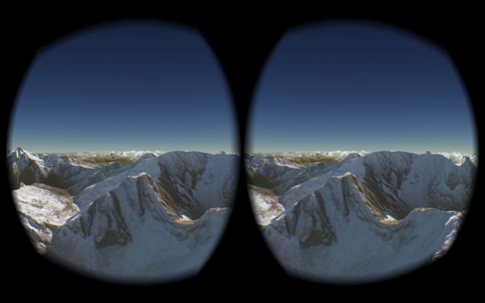

<p align="right"><a href="http://data61.csiro.au/"></a></p>

# cesium-vr

A plugin for [Cesium WebGL Virtual Globe](http://cesiumjs.org) to
support VR devices using a VR-enabled browser. This fork updates
cesium-vr to the latest CesiumJS version and uses
[WebXR](https://immersiveweb.dev/) which is the currently best
standard/proposal for the integration of VR devices for the web.

cesium-vr comes with a demo that exemplifies how to use cesium-vr:

[](http://nicta.github.io/cesium-vr/)

The source code of the demo resides in
[htdocs/index.js](htdocs/index.js)

## Cloning the repo

This repo uses submodules to pull a [modified version of
CesiumJS](https://github.com/pupitetris/cesium-webxr/tree/webxr-poc). Please
clone using:

```
git clone --recurse-submodules git@github.com:pupitetris/cesium-webxr.git
```

or

```
git clone git@github.com:pupitetris/cesium-webxr.git
git submodule init
git submodule update
```

Of course you can use `https://github.com/pupitetris/cesium-vr.git`
instead of `git@github.com:pupitetris/cesium-webxr.git`

## Usage

Please note that WebXR API specifies the restriction of not being
present in the browser unless the web page is loaded through `https`
or from `localhost`. This applies for both tethered and standalone
setups.

Check [WebXR's support table](https://immersiveweb.dev/#supporttable)
for a list of supporting web clients.

### PC-VR (Tethered HMD or no HMD)

For Valve Index, HTC Vive Cosmos/Pro, HP Reverb, Varjo, [etc](https://vr-compare.com/pcpowered).

- Run a [WebXR-enabled browser](https://caniuse.com/webxr).
  - In the case of Firefox, you have to activate the
    `dom.vr.webxr.enabled` flag in `about:config`
- Check the [WebXR Sample Pages](https://immersive-web.github.io/webxr-samples/)
  to check if your browser is WebXR-ready.

  If you have no HMD a good option for development is to install a
  WebXR Emulator extension.

  - **Google Chrome**:
    - Mozilla Mixed Reality's [WebXR API Emulator](https://chrome.google.com/webstore/detail/webxr-api-emulator/mjddjgeghkdijejnciaefnkjmkafnnje)
    - Meta's [Immersive Web Emulator](https://chrome.google.com/webstore/detail/immersive-web-emulator/cgffilbpcibhmcfbgggfhfolhkfbhmik)
  - **Mozilla Firefox**:
    - Mozilla Mixed Reality's [WebXR API Emulator](https://addons.mozilla.org/en-US/firefox/addon/webxr-api-emulator/)
  - **Microsoft Edge**:
    - Meta's [Immersive Web Emulator](https://microsoftedge.microsoft.com/addons/detail/immersive-web-emulator/hhlkbhldhffpeibcfggfndbkfohndamj)

### Standalone HMD

For Oculus/Meta Quest, Pico, HTC Vive Focus, [etc](https://vr-compare.com/standalone).

- **Option 1**: use http to localhost with [reverse port forwarding](https://medium.com/@lazerwalker/how-to-easily-test-your-webvr-and-webxr-projects-locally-on-your-oculus-quest-eec26a03b7ee).

  No need for https certificate generation, but HMD must be used
  connected to the computer through USB to reach the http server.

  - Enable Developer Mode in your headset.
  - Connect to a host PC through USB
  - Install `adb` in the host (Debian Linux: `apt install adb`)
  - If you have [SideQuest](https://sidequestvr.com/) up and
    running, you can use that to issue the `adb reverse` command
    and skip the manual adb setup.
  - From a terminal in the host, run `adb devices`
    - Meta Quest: if your device does not appear, [check your Meta
      account status](https://developer.oculus.com/manage/) and make
      sure that it is configured as a Developer's account and
      verified.  ToS changes may invalidate your account and the Quest
      will drop developer mode until the situation is fixed.
    - Linux: If adb complaints about udev rules, you may need to create (as
      `root`) the file `/lib/udev/rules.d/52-hmd.rules` with the content:

      ```
      SUBSYSTEM=="usb", ATTR{idVendor}=="2833", MODE="0660", GROUP="plugdev", TAG+="uaccess", SYMLINK+="ocuquest%n", ENV{adb_user}="yes"
      ```

      - `idVendor`/`idProduct` may vary, check with `lsusb` and adjust
        accordingly.
      - Then to make the changes effective to the udev subsystem, run:

        ```
        sudo udevadm control --reload-rules
        sudo systemctl restart systemd-udevd.service
        ```

      - Make sure your user belongs to the group `plugdev` (run `id` to
        check) or whatever permissions your distro requires for you to
        use adb (`plugdev` in Debian allows members to mount USB mass
        storage devices and other removable media).
      - The upstream authority on this topic seems to be in the
        [android-udev-rules github repo](https://github.com/M0Rf30/android-udev-rules).
        In theory you can grab the latest udev rules for Android devices from there and
        install them on your system, but YMMV. Good source to study how to fix this problem.

  - Authorize computer on HMD.
  - Set up reverse forwarding through adb (`adb reverse tcp:8080 tcp:8080`)
  - This may have to be reissued between sessions.
  - Run HMD's web browser

- **Option 2**: Run the http server with https (ssl) enabled.
  - Can be used over WiFi
  - You have to [create a self-signed
    certificate](https://wiki.debian.org/Self-Signed_Certificate) or
    if that won't work, use [Let's Encrypt](https://letsencrypt.org/)
    to generate legit certificates for free, but you may have to pay
    for a host or spoof the HMD's DNS system.

### Final steps for both PC-VR and Stand-alone

- Run a local http server from the project root directory, e.g. with
  node.js http-server

    ```
  sudo apt install node-http-server
    cd cesium-vr/htdocs
  ln -s ../src src
    http-server
    ```

  OR use the included python3 server:

  ```
  cd cesium-vr
  python3 server.py
  ```

- Using your browser, visit `http://localhost:8080/` (or `https://localhost:4443/`).

### Interaction

#### Legacy

- Hit `Enter` to make the browser fullscreen and enter VR mode.
- The mouse can be used on the left eye to navigate.  Number keys take
  you to some pre-set locations. Hit `L` at any time to level the
  camera to the globe surface.
- The `WASD` keys allow horizontal movement with `Q` and `E` allowing
  vertical movement. Holding `Shift` speeds up all movement.

#### Meta Quest 2

- As expected, use the HMD to point the camera in 3DoF. You should
  interact while standing or sitting on a rotating seat.
- Both left and right controls work the same, at the same time, but
  all interaction can be achieved with one control.
- Relative to the camera orientation, the stick will translate forwards
  and laterally (±X and ±Z).
- Use the thumb trigger to go up, relative to the camera orientation (+Y).
- Use the main trigger to amplify movement, up to 10 times faster.
- Tip: if you want advance while looking down but don't want to lose
  altitude, press the thumb trigger lightly to compensate.

If you are having any problems, visit the [WebXR Sample
Pages](https://immersive-web.github.io/webxr-samples/) to check you
have correctly configured your VR device for use in your browser. If
you're still having troubles, feel free to post an issue on the GitHub
repository.

## Testing

*Note: obsolete info*

At time of writing we have tested **cesium-vr** with Cesium 1.10 in
Firefox Nightly 41.0a1 (2015-05-13) on Windows and OSX using the
Oculus Rift Development Kit 2 and Oculus Runtime 0.5.0.1.  Stereo
rendering should work on other platforms but WebVR may not.

## About

### Stereo Rendering

To render stereo images within Cesium using a single scene and dual
canvases the workflow is as follows.

For each frame:

* Set scene and camera parameters for right eye.
* Render into left eye canvas.
* Canvas copy from left eye canvas to right eye canvas.
* Set scene and camera parameters for left eye.
* Render into left eye canvas.

### Frustum offsetting

We have applied a small modification to Cesium's PerspectiveFrustum
class.  This allows us to apply the required frustum offset e.g. so
the standard globe doesn't render in the center of each canvas. These
modifications are currently being patched into Cesium by replacing the
cameras frustum object with our implementation.

### WebXR

For more information regarding WebXR or the VR-enabled browsers, check
out [immersiveweb.dev](https://immersiveweb.dev/).

### Contributing

Please let us know if you spot any errors in our implementation or
have a useful extension.  The best way to do this is via a pull
request.

## License

The **cesium-vr** plugin code is released under Apache 2.0 (see
[LICENSE.md](pupitetris/LICENSE.md)).

This software will need you to go and acquire third party software in
order to work properly; and NICTA is not suggesting that downloading
and using the third party software is necessarily compliant with, or
compatible with the Apache 2.0 license; and use of the third party
software is entirely at the discretion (and risk) of the licensee.
